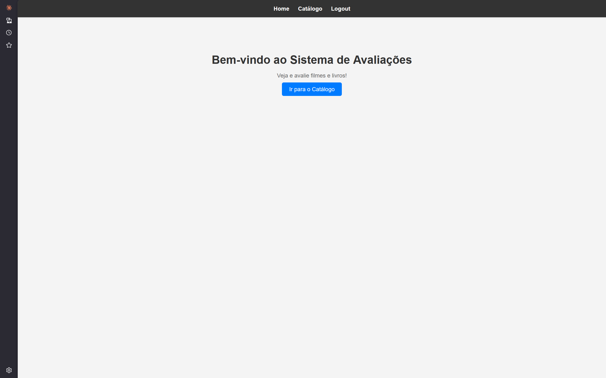
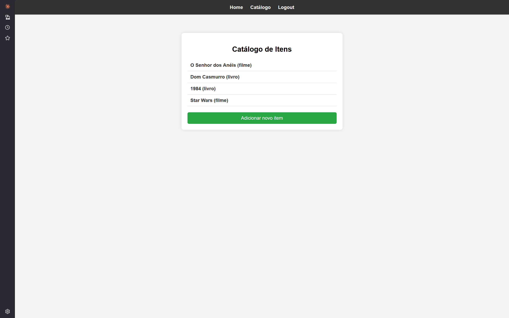
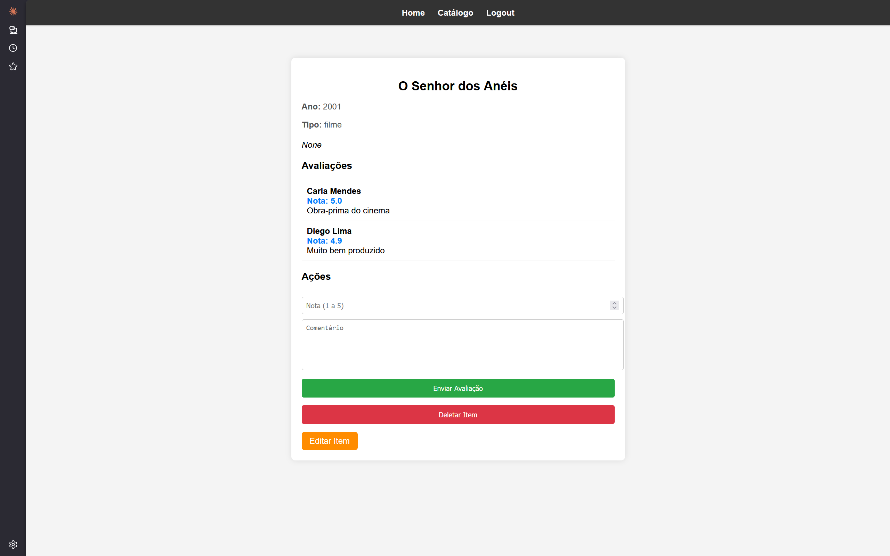
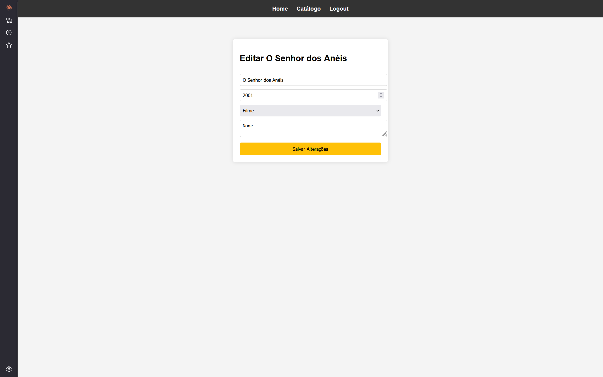
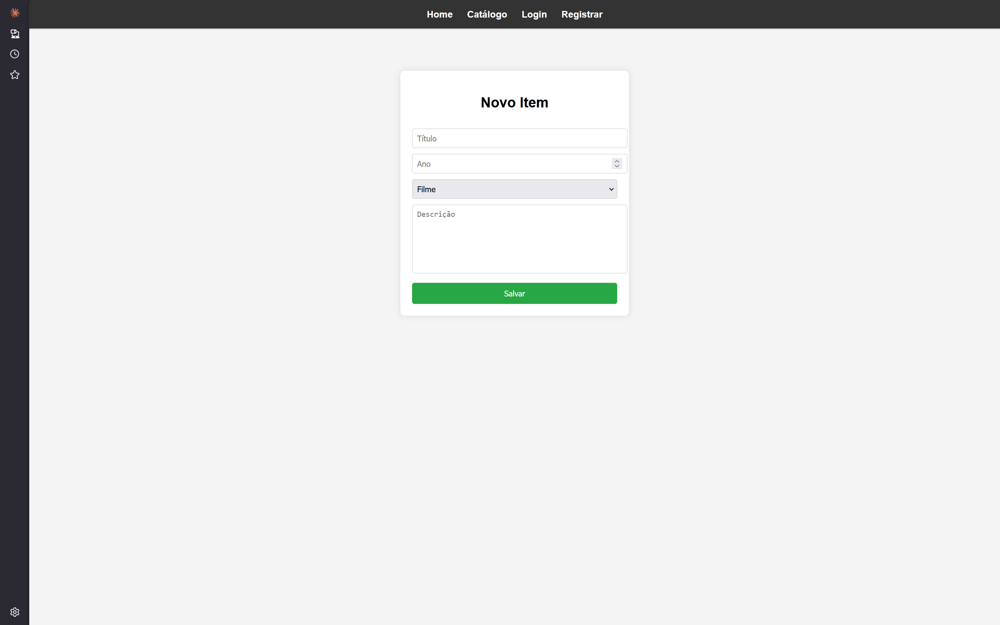
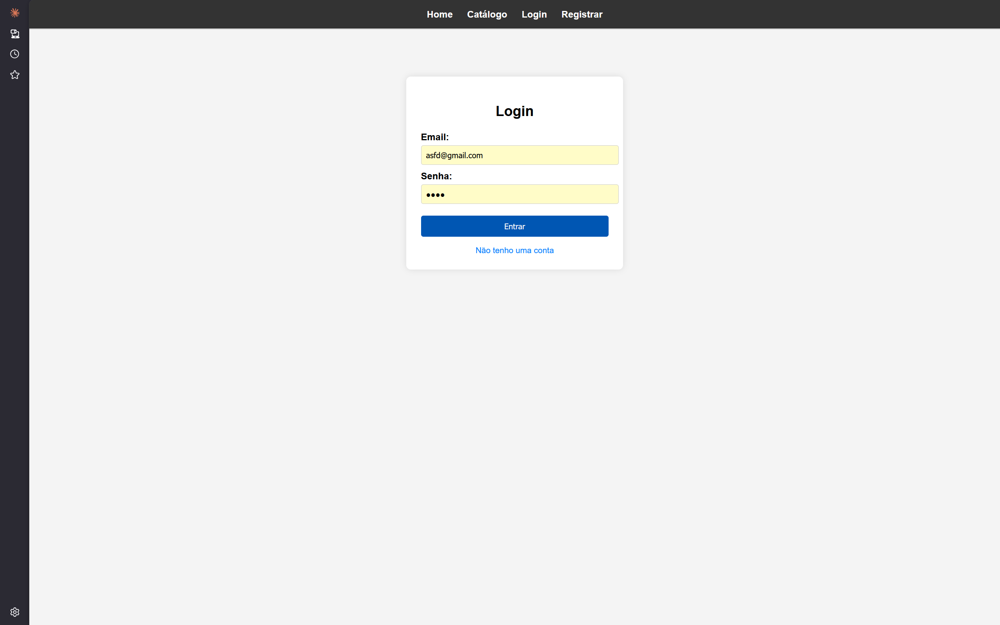
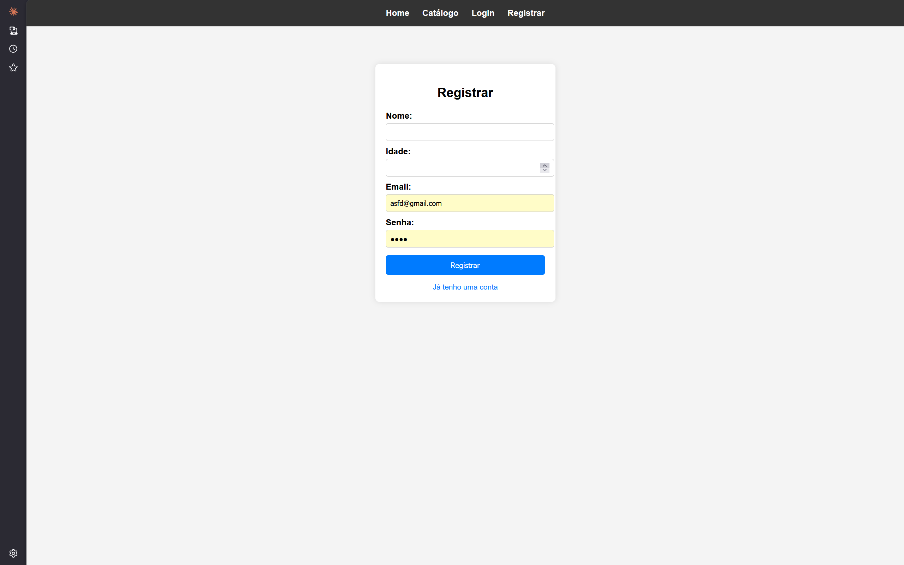

# 📚 Sistema de Avaliação com Controle de Duplicidade

## 📌 Descrição do Sistema

Este projeto consiste em uma aplicação backend desenvolvida com Flask para permitir que usuários avaliem itens (filmes e livros).

O sistema permite:
- Cadastro e login de usuários
- Cadastro e listagem de itens
- Avaliação de itens com notas e comentários

A principal regra de negócio é impedir que um mesmo usuário avalie o mesmo item mais de uma vez, garantindo a integridade dos dados.

---

## 🗄️ Estrutura do Banco de Dados

O sistema utiliza um banco MySQL chamado `controle_duplicidade`.

### 👤 Tabela: usuarios

| Campo        | Tipo         | Descrição |
|-------------|-------------|----------|
| id_usuario  | INT (PK)    | Identificador do usuário |
| nome        | CHAR(50)    | Nome |
| idade       | INT         | Idade |
| senha       | VARCHAR(50) | Senha |
| gmail       | VARCHAR(50) | Email |

---

### 🎬📚 Tabela: itens

| Campo      | Tipo            | Descrição |
|-----------|----------------|----------|
| id_item   | INT (PK)        | Identificador do item |
| titulo    | VARCHAR(50)     | Nome do item |
| ano       | INT             | Ano |
| tipo      | ENUM            | 'filme' ou 'livro' |
| descricao | VARCHAR(255)    | Descrição |

---

### 🎥 Tabela: filmes

| Campo    | Tipo        | Descrição |
|---------|------------|----------|
| id_item | INT (PK/FK) | Referência ao item |
| genero  | CHAR(50)    | Gênero |
| duracao | INT         | Duração |

Relacionamento:
- 1:1 com `itens`
- ON DELETE CASCADE

---

### 📖 Tabela: livros

| Campo    | Tipo        | Descrição |
|---------|------------|----------|
| id_item | INT (PK/FK) | Referência ao item |
| paginas | INT         | Número de páginas |

Relacionamento:
- 1:1 com `itens`
- ON DELETE CASCADE

---

### ⭐ Tabela: avaliacoes

| Campo         | Tipo           | Descrição |
|--------------|---------------|----------|
| id_avaliacao | INT (PK)       | ID da avaliação |
| id_usuario   | INT (FK)       | Usuário |
| id_item      | INT (FK)       | Item |
| nota         | DECIMAL(2,1)   | Nota (1 a 5) |
| comentario   | TEXT           | Comentário |

Relacionamentos:
- N:1 com `usuarios`
- N:1 com `itens`

---

## 🔗 Rotas da Aplicação

### 🏠 Gerais
- `/` → Página inicial

---

### 👤 Usuários
- `/login` → Login
- `/registrar` → Cadastro
- `/logout` → Logout

---

### 📚 Itens
- `/catalogo` → Lista todos os itens
- `/item/<id>` → Detalhes + avaliações
- `/novo_item` → Criar item
- `/editar_item/<id>` → Editar item

---

## ⚙️ Regras de Negócio

- Um usuário não pode avaliar o mesmo item mais de uma vez
- A nota deve estar entre 1 e 5
- Apenas usuários logados podem avaliar
- Um item só pode ser excluído removendo antes suas avaliações
- Integridade garantida por chaves estrangeiras no banco

---

## ▶️ Como Executar o Projeto

### 1. Clonar o repositório
```bash
git clone <repo>
cd <repo>
```

### 2. Criar ambiente virtual
```bash
python -m venv venv
```

Ativar no Windows:

```bash
venv\Scripts\activate
```

### 3. Instalar dependências

```bash
pip install -r requirements.txt
```

### 4. Configurar variáveis de ambiente (.env)

Criar um arquivo .env na raiz do projeto com o seguinte conteúdo:
```
DB_USER=appuser
DB_PASSWORD=sua_senha
DB_HOST=localhost
DB_NAME=controle_duplicidade
SECRET_KEY=qualquer_coisa_segura
```

### 5. Criar banco de dados no MySQL
```sql
CREATE DATABASE controle_duplicidade;
```
###6. Rodar migrations
```
flask --app src.app:create_app db upgrade
```

### 7. Executar o projeto

Opção 1:

```bash
python src/app.py
```

Opção 2:
```bash
flask --app src.app:create_app run
```

## 🖼️ Prints do Sistema

### Tela inicial


### Catálogo


### Página do item


### Edição de item


### Adição de item


### Página de login


### Registro de usuário


🎥 Vídeo de Demonstração

(INSERIR LINK AQUI)

## 👥 Integrantes

- Marcelo Eduardo Silva e Santos Lopes - 22605017
- Lucas Silva Martins - 22502092